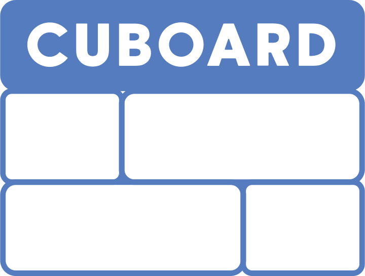

[](https://github.com/wyhinton/dx_display_iframe_prototype/actions/workflows/firebase.js.yml/badge.svg)
[](https://opensource.org/licenses/MIT)
[](https://badges.aleen42.com/src/typescript.svg)
[](https://badges.aleen42.com/src/react.svg)





# Cuboard
Cuboard is an open source content-sharing app built with touch screens in mind. Cuboard allows you to curate and design attractive masonry grids for displays. Types of content you can display include iframes, videos, and images, just provide a link to the source and Cuboard will take care of appropriately resizing it. 

Your Cuboard content is provided 100% client side by your Google Sheet, so need for a custom sever or database. Within the apps editor mode, drag and drop your content into the grid, and resize them as desired. 

 Once you're satisfied, push new layouts to your Google Sheet via an embedded google form. Drag and drop layouts to switch between them, or use Cycle mode to switch between them at a custom interval. See [Backend Setup](#backend-setup) for details on setting up your sheet and form. Cuboard is made with React + Typescript. 

# Live Demo
- https://iframeprototype-83a96.web.app/

# Features
- Proven, scalable, and easy to understand project structure
- Written in modern React, only functional components with hooks 
- Centralized and easy to debug state management with easy-peasy

# Backend Setup
To set up your custom backend, just follow these steps:

## Setup a Google Sheet for your Content
This sheet will store the list of available content to use in your display. Cuboard will fetch this sheet. 
1. Create a copy of [this template google sheet](https://docs.google.com/spreadsheets/d/1BR1AQ5Zmt_o_0dOm9AvDht0G3Q6RXQUhX71Vi4H7tTU/edit?usp=sharing)
2. In your new sheet, got to File>Publish to Web. Select "Entire Document" and "Comma-seperated values (.csv)". 
3. Hit the "Share" button, make sure permissions are set to "Anyone with link", then hit "Copy Link" and 


## Setup a Google Form for adding New Layouts
This form allows you to push new layouts to a google sheet. 
1. Create a copy of [this google form](https://docs.google.com/forms/d/1Y2621OA3qI_Cv-Tf5zZvlV0pzVQWq2XUi90odYThzeY/edit?usp=sharing). 
2. Go to Responses, then click the Google Sheets Icon to connect the from to the Google Sheet. 
3. Select the sheet you created in Part 1. 

## Add From Links to appConfig.ts
Now connect the app to your form and sheet by supplying the links to ```static/appConfig.ts```:

```typescript
const appConfig: AppConfig = {
    idleTime: process.env.NODE_ENV === "development"?100000000:10000000,
    sheetLink: YOUR_SHEET_LINK,
    formLink: YOUR_FORM_LINK,
}

export default appConfig
```

# Quick Start

1. Clone the repository and change directory.

```
git clone https://github.com/wyhinton/dx_display_iframe_prototype.git
cd dx_display_iframe_prototype
```

2. Install yarn dependencies

```
yarn install
```

3. Run the app locally.

```
yarn start
```

### Dev Environment 
When developing your Cuboard, we suggest the following plugins:

### Chrome Plugins 
- [Redux DevTool](https://chrome.google.com/webstore/detail/redux-devtools/lmhkpmbekcpmknklioeibfkpmmfibljd?hl=en) - for debugging application's state
- [React Developer Tools](https://chrome.google.com/webstore/detail/react-developer-tools/fmkadmapgofadopljbjfkapdkoienihi?hl=en) - inspect the React component hierarchies 


# Libraries
- [react-use](https://github.com/streamich/react-use#readme) - Provides useful hooks for event handling like ```useIdle``` and ```useLongPress```
- [react-grid-layout](https://github.com/react-grid-layout/react-grid-layout) - Draggable and resizable grid layout with responsive breakpoints. Used for editing and display our card layotus.
- [evergreen-ui](https://github.com/segmentio/evergreen) - React UI framework. Provides some  componets for things like Buttons, Menus, etc., that work well with the projects design language. Allows us to avoid having to basic UI components from scratch. 
- [easy-peasy](https://github.com/ctrlplusb/easy-peasy) - Redux wrapper which allows us to design clear, centralized state managment for our application.

# Learning Resources
### react-grid-layout
- ["React grid layout from TypeScript" codesandbox example](https://codesandbox.io/s/react-grid-layout-from-typescript-forked-46zp2)
### Github Actions 
- [Deploy React Application To Firebase Using GitHub Actions](https://www.youtube.com/watch?v=kLEp5tGDqcI)
### Typescript 
- [Five tips I wish I knew when I started with Typescript](https://codeburst.io/five-tips-i-wish-i-knew-when-i-started-with-typescript-c9e8609029db)
- [Learn TypeScript #6, Advanced Classes](https://www.youtube.com/watch?v=OaxeCPWTdcA)
# Components


&copy; 2016-Present NCSU